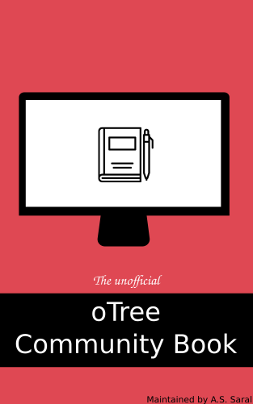

About this document
============================

## What is this?
This is a collaborative open book and course materials about experimental economics software [oTree](https://www.otree.org/). 

The course material is licensed under <a rel="ccalicense" href="http://creativecommons.org/licenses/by/4.0/">Creative Commons Attribution 4.0 International License</a> and the supporting code is licensed under <a rel="mitlicense" href="https://opensource.org/licenses/MIT"> MIT License </a>.

You are free to copy, modify and distribute the materials as long as you attribute to the original content. Moreover we encourage all contributions to this collection. Feel free to discuss, make suggestions, fix bugs and typos and contribute to the book by providing content. To learn more about contributing, please read [CONTRIBUTING.md](https://github.com/seyhunsaral/otree-course/blob/master/CONTRIBUTING.md)

This book was started as a collection of lecture notes for the oTree workshop at the *Max Planck Institute for Research on Collective Goods* in 2020. 

Created and currently maintained by [Ali Seyhun Saral](https://www.saral.it)

## Prequisites
Of course you are free dive into the notes and you will be probably able to follow along and build your experiments. But I have several assumptions about the typical audience of the book has the following:
* A general knowledge about experimental methods in social sciences,
* A basic knowledge of programming in Python (or at least in other programming language),
* Ability to use the command line.

If you are missing the technical aspects (item 2 and 3), you can just try to follow and evaluate yourself. Of course Python is a huge general programming language. So we will be using a small subset of it. You can take a look at the `Python Refresher` chapter in order to compare your knowledge or which parts you need to work on in case.

## Good to have
As oTree often requires few codes in different languages like `JavaScript`, `HTML`, `CSS` and so on, any kind of knowledge on either of them helps. I will try to cover also the basics of each of those but the priority will be on teaching the concepts of `oTree`. So for a deeper understanding on these languages, you can refer to other resources. But this is **not necessary for this course**.

## Resources

* [GitHub Repository of the course](https://github.com/seyhunsaral/otree-course)

* [oTree Official Website](https://www.otree.org/)
* [oTree Documentation](https://otree.readthedocs.io/en/latest/)
* [oTree Paper (Chen et al. 2016)](https://www.sciencedirect.com/science/article/pii/S2214635016000101)
* [oTree Course by Matteo Ploner](http://matteoploner.eco.unitn.it/courses/oTreeIntro/oTree.html)

<!--
## Acknowledgements
    This document is shaped by oTree meetings initiated by `Christoph Engel` at the Max Planck Institute for Research on Collective Goods. I would like to thank all of the participants of these meetings. I am very grateful to `Oliver Kirchkamp` for his comments during these meetings. I would like to thank `Matteo Ploner` as I benefited from his [publicly available course on oTree](http://matteoploner.eco.unitn.it/courses/oTreeIntro/oTree.html) when I prepare the structure of the course and I was inspired of some of his examples and representations.

-->
 
 

 oTree Community Book <a xmlns:cc="http://creativecommons.org/ns#" href="https://otreecb.netlify.app" property="cc:attributionName" rel="cc:attributionURL">https://otreecb.netlify.app</a> is licensed under a <a rel="license" href="http://creativecommons.org/licenses/by/4.0/">Creative Commons Attribution 4.0 International License</a>. Based on a work at <a xmlns:dct="http://purl.org/dc/terms/" href="https://www.github.com/seyhunsaral/otree-course" rel="dct:source">https://www.github.com/seyhunsaral/otree-course</a>.

